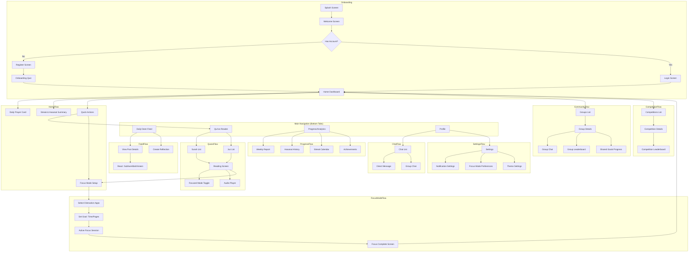

# Qur'an Companion App - UI/UX Blueprint

## Document Purpose
This blueprint provides UI/UX designers with the complete user flow, screen specifications, and wireframe descriptions for the Qur'an Companion App — a "Social Spiritual Ecosystem" for consistent Qur'an engagement.

---

## 1. Master User Flow



---

## 2. Screen Inventory (~35 Screens)

| # | Screen Name | Category | Priority |
|---|-------------|----------|----------|
| 1 | Splash Screen | Onboarding | P0 |
| 2 | Welcome Screen | Onboarding | P0 |
| 3 | Login Screen | Onboarding | P0 |
| 4 | Register Screen | Onboarding | P0 |
| 5 | Onboarding Quiz | Onboarding | P0 |
| 6 | Home Dashboard | Core | P0 |
| 7 | Daily Deen Feed | Social | P0 |
| 8 | Post Detail | Social | P1 |
| 9 | Create Reflection | Social | P1 |
| 10 | Qur'an Index (Surah/Juz) | Core | P0 |
| 11 | Qur'an Reading Screen | Core | P0 |
| 12 | Focused Reading Mode | Core | P0 |
| 13 | Audio Player Overlay | Core | P1 |
| 14 | Focus Mode Setup | Focus | P0 |
| 15 | Active Focus Session | Focus | P0 |
| 16 | Focus Complete | Focus | P0 |
| 17 | Focus History | Focus | P1 |
| 18 | Progress Dashboard | Analytics | P0 |
| 19 | Weekly Report | Analytics | P1 |
| 20 | Hasanat History | Analytics | P1 |
| 21 | Streak Calendar | Analytics | P1 |
| 22 | Achievements Gallery | Gamification | P1 |
| 23 | Groups List | Community | P0 |
| 24 | Group Details | Community | P0 |
| 25 | Group Chat | Community | P0 |
| 26 | Create Group | Community | P1 |
| 27 | Competitions List | Gamification | P0 |
| 28 | Competition Details | Gamification | P0 |
| 29 | Create Competition | Gamification | P1 |
| 30 | Leaderboard | Gamification | P0 |
| 31 | Chat List | Messaging | P0 |
| 32 | Direct Message | Messaging | P0 |
| 33 | Profile Screen | Account | P0 |
| 34 | Settings | Account | P0 |
| 35 | Dhikr Counter | Utility | P1 |
| 36 | Prayer Calendar | Utility | P1 |
| 37 | Quranic Gems | Content | P2 |

---

## 3. Screen Specifications & Wireframes

---

### 3.1 Onboarding Flow

#### Screen 1: Splash Screen
**Purpose:** Brand introduction and app loading state.

```
┌─────────────────────────────┐
│                             │
│                             │
│                             │
│         [APP LOGO]          │
│                             │
│       "Qur'an Focus"        │
│                             │
│ VISUALIZING THE INVISIBLE REWARD
│                             │
│             ◓               │
│         (Spinner)           │
│                             │
└─────────────────────────────┘
```

**Elements:**
- App logo (centered, large)
- App name: "Qur'an Focus"
- Vision Motto: "VISUALIZING THE INVISIBLE REWARD"
- Subtle loading spinner (CSS animation)

---

#### Screen 2: Intro / Welcome Screen
**Purpose:** Introduce the app's value proposition and direct to login/register.

```
┌─────────────────────────────┐
│                             │
│     [ILLUSTRATION]          │
│     Person reading Quran    │
│                             │
│ "A Social Spiritual Ecosystem"
│                             │
│  Build consistency, earn    │
│  Hasanat, and connect with  │
│  your community.            │
│                             │
│  ┌───────────────────────┐  │
│  │    Get Started        │  │
│  └───────────────────────┘  │
│                             │
│  Already have an account?   │
│         [Login]             │
│                             │
└─────────────────────────────┘
```

**Elements:**
- Inspiring illustration
- Headline: "A Social Spiritual Ecosystem"
- Subtext emphasizing consistency, Hasanat, and community
- Primary CTA: "Get Started"
- Secondary link: "Login"

---

#### Screen 3: Login Screen
**Purpose:** Authenticate existing users.

```
┌─────────────────────────────┐
│  ←                          │
│                             │
│      Welcome Back           │
│                             │
│  ┌───────────────────────┐  │
│  │ Email or Phone        │  │
│  └───────────────────────┘  │
│                             │
│  ┌───────────────────────┐  │
│  │ Password          👁   │  │
│  └───────────────────────┘  │
│                             │
│       Forgot Password?      │
│                             │
│  ┌───────────────────────┐  │
│  │        Login          │  │
│  └───────────────────────┘  │
│                             │
│  Don't have an account?     │
│        [Register]           │
│                             │
└─────────────────────────────┘
```

---

#### Screen 4: Register Screen
**Purpose:** Create new user accounts.

```
┌─────────────────────────────┐
│  ←                          │
│                             │
│      Create Account         │
│                             │
│  ┌───────────────────────┐  │
│  │ Full Name             │  │
│  └───────────────────────┘  │
│  ┌───────────────────────┐  │
│  │ Email or Phone        │  │
│  └───────────────────────┘  │
│  ┌───────────────────────┐  │
│  │ Password          👁   │  │
│  └───────────────────────┘  │
│  ┌───────────────────────┐  │
│  │ Confirm Password  👁   │  │
│  └───────────────────────┘  │
│                             │
│  ☐ I agree to Terms         │
│                             │
│  ┌───────────────────────┐  │
│  │      Register         │  │
│  └───────────────────────┘  │
│                             │
└─────────────────────────────┘
```

---

#### Screen 5: Onboarding Quiz
**Purpose:** Personalize the experience based on user's proficiency and goals.

```
┌─────────────────────────────┐
│                     Skip →  │
│                             │
│  Step 1 of 4    ━━━━○○○○    │
│                             │
│  "What's your Arabic        │
│   reading level?"           │
│                             │
│  ┌───────────────────────┐  │
│  │ ○ Beginner            │  │
│  │   (I need translation)│  │
│  └───────────────────────┘  │
│  ┌───────────────────────┐  │
│  │ ● Intermediate        │  │
│  │   (I can read slowly) │  │
│  └───────────────────────┘  │
│  ┌───────────────────────┐  │
│  │ ○ Advanced            │  │
│  │   (Fluent reader)     │  │
│  └───────────────────────┘  │
│                             │
│  ┌───────────────────────┐  │
│  │       Continue        │  │
│  └───────────────────────┘  │
└─────────────────────────────┘
```

**Quiz Steps:**
1. **Reading Goals:** Select from level (Beginner/Intermediate/Advanced).
2. **Commitment:** Daily goal (5 min / 10 min / 20 min / 45 min).
3. **Reminders:** Preferred time for notifications.
4. **Interest Areas:** Select topics (Patience, Gratitude, Hope, Resilience, Focus).

---

### 3.2 Core Navigation

#### Screen 6: Home Dashboard
**Purpose:** Central hub showing today's progress, quick actions, and highlights.

```
┌─────────────────────────────┐
│  Assalamu Alaikum, Ahmed    │
│                             │
│  ┌───────────────────────┐  │
│  │ 📅 12 Rajab • Fajr in 2h │  │
│  └───────────────────────┘  │
│                             │
│  ┌───────────────────────┐  │
│  │  📿 Your Hasanat      │  │
│  │  Today: +1,250        │  │
│  │  Total: 42,500        │  │
│  └───────────────────────┘  │
│                             │
│  ┌─────────┐ ┌─────────┐   │
│  │📖 Read  │ │🎧 Listen│   │
│  └─────────┘ └─────────┘   │
│  ┌─────────┐ ┌─────────┐   │
│  │🔒 Focus │ │📿 Dhikr │   │
│  └─────────┘ └─────────┘   │
│                             │
│  ── Daily Deen Activity ──  │
│  (Posts with SubhanAllah)   │
│                             │
├─────────────────────────────┤
│ 🏠   📰   📖   📊   👤     │
└─────────────────────────────┘
```

**Elements:**
- Personalized greeting
- Hijri/Prayer info bar
- Hasanat Counter card (Hasanat Engine visual)
- Quick action grid (Read, Listen, Focus, Dhikr)
- Feed highlights preview (Community integration)
- Bottom navigation (Main App Shell)

---

### 3.3 Daily Deen Feed

#### Screen 7: Daily Deen Feed
**Purpose:** Social hub for milestones, reflections, and community engagement.

```
┌─────────────────────────────┐
│  Daily Deen               + │
├─────────────────────────────┤
│  [All] [Friends] [Groups]   │
├─────────────────────────────┤
│                             │
│  ┌───────────────────────┐  │
│  │ 👤 Omar • 2h ago      │  │
│  │ ────────────────────  │  │
│  │ 🏆 Completed Juz 3!   │  │
│  │                       │  │
│  │ "Alhamdulillah, one   │  │
│  │  step closer..."      │  │
│  │                       │  │
│  │ SubhanAllah (23)      │  │
│  │ Ameen (12) • Comment  │  │
│  └───────────────────────┘  │
│                             │
│  ┌───────────────────────┐  │
│  │ 👤 Aisha • 5h ago     │  │
│  │ ────────────────────  │  │
│  │ 📝 Reflection         │  │
│  │                       │  │
│  │ "وَقُل رَّبِّ زِدْنِي   │  │
│  │  عِلْمًا"              │  │
│  │ [Surah Ta-Ha: 114]    │  │
│  │                       │  │
│  │ "This ayah reminds    │  │
│  │  me to always seek..."│  │
│  │                       │  │
│  │ SubhanAllah • Ameen   │  │
│  └───────────────────────┘  │
│                             │
├─────────────────────────────┤
│ 🏠   📰   📖   📊   👤     │
└─────────────────────────────┘
```

**Post Types:**
- **Milestone:** Auto-generated on reading progress (e.g., "Just finished a 20-min focus session").
- **Reflection:** User-generated Tadabbur with Ayah reference.
- **Engagement:** Group competition updates or badge unlocks.

**Reactions (Islamic Context):**
- **SubhanAllah (🤲):** Used to acknowledge Allah's glory in others' achievements.
- **Ameen (🤲):** Used to affirm prayers or reflections.
- *Replaces generic "Likes" to foster a social spiritual ecosystem.*

---

### 3.4 Qur'an Reading Experience

#### Screen 10: Qur'an Index
**Purpose:** Navigate to any Surah or Juz.

```
┌─────────────────────────────┐
│  Qur'an              🔍     │
├─────────────────────────────┤
│  [Surah]      [Juz]         │
├─────────────────────────────┤
│                             │
│  📖 Continue Reading        │
│  Surah Al-Baqarah, Ayah 142 │
│  ───────────────────────────│
│                             │
│  1. Al-Fatihah (الفاتحة)    │
│     The Opening • 7 Ayahs   │
│                             │
│  2. Al-Baqarah (البقرة)     │
│     The Cow • 286 Ayahs     │
│     ━━━━━━━○ 49% complete   │
│                             │
│  3. Ali 'Imran (آل عمران)   │
│     Family of Imran • 200   │
│                             │
│  4. An-Nisa (النساء)        │
│     The Women • 176 Ayahs   │
│                             │
│  ...                        │
│                             │
├─────────────────────────────┤
│ 🏠   📰   📖   📊   👤     │
└─────────────────────────────┘
```

---

#### Screen 11: Qur'an Reading Screen
**Purpose:** The core reading experience with live Hasanat counter.

```
┌─────────────────────────────┐
│  ←  Al-Baqarah      ⚙ 🔊   │
│  ┌───────────────────────┐  │
│  │ +1,240 Hasanat 📿     │  │
│  └───────────────────────┘  │
├─────────────────────────────┤
│                             │
│  بِسْمِ اللَّهِ الرَّحْمَـٰنِ │
│  الرَّحِيمِ                 │
│                             │
│  ──────────────────────     │
│                             │
│  الٓمٓ ﴿١﴾                  │
│                             │
│  ذَٰلِكَ الْكِتَابُ لَا رَيْبَ │
│  فِيهِ هُدًى لِّلْمُتَّقِينَ │
│  ﴿٢﴾                        │
│                             │
│  الَّذِينَ يُؤْمِنُونَ      │
│  بِالْغَيْبِ وَيُقِيمُونَ   │
│  الصَّلَاةَ وَمِمَّا         │
│  رَزَقْنَاهُمْ يُنفِقُونَ   │
│  ﴿٣﴾                        │
│                             │
├─────────────────────────────┤
│  Ayah 3 / 286               │
│  ┌────┐ ┌────┐ ┌─────────┐  │
│  │ Aa │ │ 📝 │ │🔒 Focus │  │
│  └────┘ └────┘ └─────────┘  │
└─────────────────────────────┘
```

**Elements:**
- Sticky Hasanat counter (top)
- Arabic text (large, readable)
- Optional translation toggle
- Ayah progress indicator
- Action bar: Font size, Translation, Focus Mode

---

#### Screen 12: Focused Reading Mode
**Purpose:** Single ayah view with translation and tafsir for deep focus.

```
┌─────────────────────────────┐
│  ←  Focused Mode    1/286   │
├─────────────────────────────┤
│                             │
│                             │
│                             │
│  ذَٰلِكَ الْكِتَابُ لَا رَيْبَ │
│  فِيهِ هُدًى لِّلْمُتَّقِينَ │
│                             │
│  ──────────────────────     │
│                             │
│  "This is the Book about    │
│   which there is no doubt,  │
│   a guidance for those      │
│   conscious of Allah."      │
│                             │
│  ──────────────────────     │
│                             │
│  📖 Tafsir                  │
│  Ibn Kathir explains that   │
│  "Al-Kitab" refers to the   │
│  Quran itself, and "la      │
│  rayba feehi" means...      │
│  [Read more]                │
│                             │
├─────────────────────────────┤
│      ←  ●●○○○  →            │
│   [Previous]    [Next]      │
└─────────────────────────────┘
```

---

### 3.5 Focus Mode (Targeted Session)
*Note: This is distinct from Normal Reading (Screen 10/11) which has no blockers.*

#### Screen 14: Focus Mode Setup
**Access:** From Dashboard "Focus" button OR Prayer Time Prompts.
**Purpose:** Configure distraction blocking and set reading goals (Time or Pages).

```
┌─────────────────────────────┐
│  ←      Focus Mode          │
├─────────────────────────────┤
│                             │
│  🔒 Block Distractions      │
│  Select apps to lock during │
│  your reading session:      │
│                             │
│  ┌───────────────────────┐  │
│  │ ☑ Instagram           │  │
│  │ ☑ TikTok              │  │
│  │ ☑ YouTube             │  │
│  │ ☐ WhatsApp            │  │
│  │ ☐ Twitter/X           │  │
│  └───────────────────────┘  │
│                             │
│  ── Set Your Goal ──        │
│                             │
│  [⏱ Time]    [📖 Pages]    │
│                             │
│  ┌───────────────────────┐  │
│  │       15 min          │  │
│  │    ←  ━━━━●━━  →      │  │
│  │   5    15    30   60  │  │
│  └───────────────────────┘  │
│                             │
│  ┌───────────────────────┐  │
│  │   🔒 Start Focus      │  │
│  └───────────────────────┘  │
│                             │
└─────────────────────────────┘
```

---

#### Screen 15: Active Focus Session
**Purpose:** The "locked" reading state with progress tracking.

```
┌─────────────────────────────┐
│  ──────────────────────     │
│             🔒               │
│         FOCUS MODE          │
│  ──────────────────────     │
├─────────────────────────────┤
│                             │
│      ┌─────────────┐        │
│      │             │        │
│      │   🥚→🐣     │        │
│      │   Break     │        │
│      │  the Egg!   │        │
│      │             │        │
│      └─────────────┘        │
│                             │
│         08:32               │
│       remaining             │
│                             │
│  ┌───────────────────────┐  │
│  │ +3,450 Hasanat 📿     │  │
│  └───────────────────────┘  │
│                             │
│  📖 Reading Al-Baqarah      │
│     Ayah 142 → 167          │
│                             │
│  ──────────────────────     │
│  🚫 Locked: Instagram,      │
│     TikTok, YouTube         │
│                             │
│  [End Early] (confirm)      │
└─────────────────────────────┘
```

**Gamification:**
- Visual timer (e.g., "Break the Egg" animation)
- Live Hasanat counter
- Current progress indicator
- Locked apps reminder

---

#### Screen 16: Focus Complete
**Purpose:** Celebrate completion and show session summary.

```
┌─────────────────────────────┐
│                             │
│                             │
│         ✓                   │
│      [Checkmark             │
│       Animation]            │
│                             │
│    MashaAllah!              │
│  Session Complete           │
│                             │
├─────────────────────────────┤
│                             │
│  ┌───────────────────────┐  │
│  │ ⏱ 15 min focused      │  │
│  │ 📖 25 ayahs read      │  │
│  │ 📿 +5,230 Hasanat     │  │
│  └───────────────────────┘  │
│                             │
│  🔥 Streak: 15 days!        │
│                             │
│  ── Unlock Earned ──        │
│  🏅 Focus Master Badge      │
│                             │
│  ┌───────────────────────┐  │
│  │    Share to Feed      │  │
│  └───────────────────────┘  │
│  ┌───────────────────────┐  │
│  │   Start New Session   │  │
│  └───────────────────────┘  │
│                             │
│      [Return Home]          │
└─────────────────────────────┘
```

---

### 3.6 Progress & Analytics

#### Screen 19: Weekly Report
**Purpose:** Detailed visual breakdown of spiritual productivity and consistency.

```
┌─────────────────────────────┐
│  ←   Weekly Report    [Share]│
├─────────────────────────────┤
│      Jan 01 - Jan 07        │
│                             │
│  ┌── Focus Minutes ──┐      │
│  │  █  █  █  █  ▄  ░ │      │
│  │  M  T  W  T  F  S │      │
│  └───────────────────┘      │
│                             │
│  ┌── Spiritual Consistency ──┐
│  │  [ Heat Map Grid ]        │
│  │  (GitHub style blocks)    │
│  └───────────────────┘      │
│                             │
│  ┌── Hasanat Earned  ──┐     │
│  │  Total: 42,500 📿   │     │
│  │  (Top 5% this week) │     │
│  └───────────────────┘      │
│                             │
│      [Done]                 │
└─────────────────────────────┘
```

**Key Visuals:**
- **Productivity Bars:** Shows focus time per day.
- **Consistency Heatmap:** 7-column grid showing activity levels over several weeks.
- **Reward Summary:** Comparative stat (e.g., "Equivalent to 1.2 Khatams").

---

### 3.7 Community & Groups

#### Screen 23: Groups List
**Purpose:** Discover and manage Halaqah groups.

```
┌─────────────────────────────┐
│  Groups                  +  │
├─────────────────────────────┤
│  [My Groups] [Discover]     │
├─────────────────────────────┤
│                             │
│  ── My Groups ──            │
│                             │
│  ┌───────────────────────┐  │
│  │ 🕌 Masjid Al-Noor     │  │
│  │    12 members • Active│  │
│  │    Goal: Juz 5 by Fri │  │
│  └───────────────────────┘  │
│                             │
│  ┌───────────────────────┐  │
│  │ 👨‍👩‍👧‍👦 Family Quran      │  │
│  │    5 members          │  │
│  │    Goal: Daily 10 min │  │
│  └───────────────────────┘  │
│                             │
│  ── Discover ──             │
│                             │
│  ┌───────────────────────┐  │
│  │ 🌍 Ramadan Marathon   │  │
│  │    1,234 members      │  │
│  │    [Join]             │  │
│  └───────────────────────┘  │
│                             │
├─────────────────────────────┤
│ 🏠   📰   📖   📊   👤     │
└─────────────────────────────┘
```

---

#### Screen 24: Group Details
**Purpose:** View group info, members, shared goals, and access chat.

```
┌─────────────────────────────┐
│  ←  Masjid Al-Noor    ⚙    │
├─────────────────────────────┤
│                             │
│  ┌───────────────────────┐  │
│  │ 🕌                    │  │
│  │ Masjid Al-Noor        │  │
│  │ 12 members            │  │
│  │ Created by Omar       │  │
│  └───────────────────────┘  │
│                             │
│  ── Shared Goal ──          │
│  Complete Juz 5 by Friday   │
│  ┌───────────────────────┐  │
│  │ Group Progress: 67%   │  │
│  │ ━━━━━━━━━━━━○         │  │
│  │                       │  │
│  │ Ahmed: ████░ 80%      │  │
│  │ Fatima: ███░░ 60%     │  │
│  │ Omar: █████ 100%      │  │
│  └───────────────────────┘  │
│                             │
│  ── This Week's Top ──      │
│  🥇 Omar (1,230 Hasanat)    │
│  🥈 Ahmed (980 Hasanat)     │
│  🥉 Fatima (890 Hasanat)    │
│                             │
│  ┌───────────────────────┐  │
│  │   💬 Open Group Chat  │  │
│  └───────────────────────┘  │
│                             │
└─────────────────────────────┘
```

---

### 3.8 Competitions & Leaderboards

#### Screen 27: Competitions List
**Purpose:** Browse and join competitions.

```
┌─────────────────────────────┐
│  Competitions            +  │
├─────────────────────────────┤
│  [Active] [Upcoming] [Past] │
├─────────────────────────────┤
│                             │
│  ── Active ──               │
│                             │
│  ┌───────────────────────┐  │
│  │ 🏆 Ramadan Sprint     │  │
│  │ 3 days left           │  │
│  │ 234 participants      │  │
│  │ Your rank: #12        │  │
│  └───────────────────────┘  │
│                             │
│  ┌───────────────────────┐  │
│  │ 📖 Kahf Friday        │  │
│  │ Weekly • Surah Kahf   │  │
│  │ 89 participants       │  │
│  │ Your rank: #5         │  │
│  └───────────────────────┘  │
│                             │
│  ── Suggested ──            │
│                             │
│  ┌───────────────────────┐  │
│  │ 🌙 Night Owl          │  │
│  │ Read after Isha       │  │
│  │ [Join]                │  │
│  └───────────────────────┘  │
│                             │
├─────────────────────────────┤
│ 🏠   📰   📖   📊   👤     │
└─────────────────────────────┘
```

---

#### Screen 30: Leaderboard
**Purpose:** Global, friends, or group rankings.

```
┌─────────────────────────────┐
│  ←  Leaderboard             │
├─────────────────────────────┤
│  [Global] [Friends] [Group] │
├─────────────────────────────┤
│                             │
│  ┌───────────────────────┐  │
│  │  🥇          🥈       🥉 │  │
│  │ Omar       Ahmed    Khadija│
│  │ 5,230     4,890     4,120 │
│  └───────────────────────┘  │
│                             │
│  4.  ○ Fatima    3,980      │
│  5.  ○ Ibrahim   3,450      │
│  6.  ○ Maryam    3,120      │
│  7.  ○ Yusuf     2,890      │
│  8.  ○ Zaynab    2,780      │
│  9.  ○ Hassan    2,650      │
│  10. ○ Aisha     2,540      │
│  ...                        │
│                             │
│  ────────────────────────   │
│  👤 You: #12 (2,340)        │
│  ────────────────────────   │
│                             │
├─────────────────────────────┤
│ 🏠   📰   📖   📊   👤     │
└─────────────────────────────┘
```

---

### 3.9 Utility Screens

#### Screen 35: Dhikr Counter
**Purpose:** Simple, focused dhikr tracking.

```
┌─────────────────────────────┐
│  ←  Dhikr                   │
├─────────────────────────────┤
│                             │
│  ── Today's Recommended ──  │
│  SubhanAllah (33x)          │
│  Alhamdulillah (33x)        │
│  Allahu Akbar (34x)         │
│                             │
│  ┌───────────────────────┐  │
│  │                       │  │
│  │        سُبْحَانَ اللَّهِ │
│  │       SubhanAllah     │  │
│  │                       │  │
│  │     ┌───────────┐     │  │
│  │     │           │     │  │
│  │     │    23     │     │  │
│  │     │   / 33    │     │  │
│  │     │           │     │  │
│  │     └───────────┘     │  │
│  │                       │  │
│  │   [TAP ANYWHERE]      │  │
│  │                       │  │
│  └───────────────────────┘  │
│                             │
│  [Reset]        [Next →]    │
│                             │
└─────────────────────────────┘
```

---

#### Screen 36: Prayer Calendar
**Purpose:** View prayer times for the month.

```
┌─────────────────────────────┐
│  ←  Prayer Times      📍    │
├─────────────────────────────┤
│  January 2026               │
│  ◀  ●●●●●●●  ▶              │
├─────────────────────────────┤
│                             │
│  ── Today, Jan 1 ──         │
│  12 Rajab 1447              │
│                             │
│  ┌───────────────────────┐  │
│  │ Fajr      05:42 AM    │  │
│  │ Sunrise   07:15 AM    │  │
│  │ Dhuhr     12:30 PM ◀  │  │
│  │ Asr       03:45 PM    │  │
│  │ Maghrib   05:32 PM    │  │
│  │ Isha      07:00 PM    │  │
│  └───────────────────────┘  │
│                             │
│  🔔 Notifications: ON       │
│                             │
│  ── Upcoming ──             │
│  Jumu'ah (Friday)           │
│  Ramadan starts in 58 days  │
│                             │
├─────────────────────────────┤
│ 🏠   📰   📖   📊   👤     │
└─────────────────────────────┘
```

---

## 4. Design System Notes

### Color Palette
- **Primary**: Deep Teal (#0D7377) — Focus, spirituality
- **Accent**: Warm Gold (#FFB347) — Hasanat rewards
- **Background (Dark)**: #121212
- **Background (Light)**: #FAFAFA
- **Text Primary**: White (dark mode) / #1A1A1A (light)
- **Success**: #4CAF50 (streak achievements)
- **Warning**: #FF9800 (streak at risk)

### Dynamic Themes (by Prayer Time)
- **Fajr**: Cool blues (#1A237E)
- **Dhuhr**: Bright whites/yellows
- **Asr**: Warm oranges (#FF9800)
- **Maghrib**: Deep purples (#4A148C)
- **Isha**: Deep blues/blacks (#0D47A1)

### Typography
- **Arabic Text**: Amiri, KFGQPC, or Scheherazade New
- **UI Text**: Inter, SF Pro, or Roboto
- **Large counters**: Bold, oversized numerals

### Iconography
- Rounded, outlined icons
- Custom Islamic icons: 🕌 📿 🤲

---

## 5. Interactive Prototyping Notes

### Key Animations
1. **Hasanat Counter**: "Pop" animation on increment
2. **Streak Flame**: Flickering fire effect
3. **Focus Mode Egg**: Cracking animation on completion
4. **Goal Ring**: Circular progress fill
5. **Feed Reactions**: Heart/prayer hand burst

### Gestures
- **Swipe left/right**: Navigate between ayahs (Focused Mode)
- **Long press on Ayah**: Show tafsir/translation
- **Pull to refresh**: Update feed
- **Tap anywhere**: Increment dhikr counter

---

## 6. Next Steps for Designers

1. **Review this blueprint** and ask clarifying questions.
2. **Create high-fidelity mockups** for the 10 P0 screens first.
3. **Build a clickable prototype** in Figma covering the core user flow.
4. **Establish the design system** in a shared component library.
5. **Schedule design review** with stakeholders.

---

**Document Version:** 1.0  
**Last Updated:** January 1, 2026  
**Author:** System Analyst
